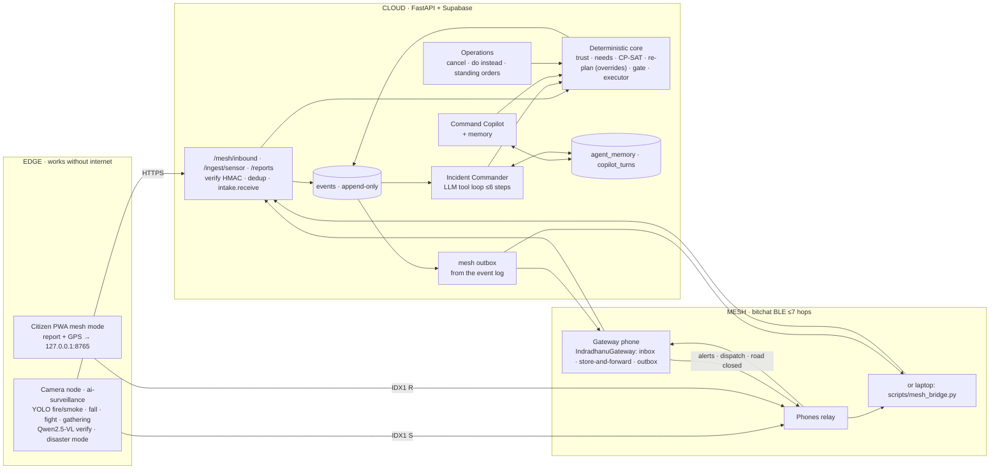

# Agentic architecture: every agent, every tool, and why it is agentic

Last updated 26 Sep 2026. Status marks: **built** is in the code and was checked
as described in [`CHANGELOG_2026-09-26.md`](CHANGELOG_2026-09-26.md); **partial**
means the code exists but has not been run end to end.

## The claim, and how to defend it

A **workflow** runs model calls along a path fixed in code. An **agent**
perceives its environment, chooses its next tool call from what the previous
one returned, and continues until its goal is met or it gives up.

Indradhanu has both, on purpose:

- The **deterministic core** (intake, trust, needs, CP-SAT allocation,
  re-planning, policy gate, executor) is a workflow. It runs the city whether or
  not any model is available, and every number comes from it.
- The **Incident Commander** is an agent. It is woken by events (a severe
  incident, a camera alert, a blocked crew), chooses its own read and simulate
  calls, and ends by proposing an action to the policy gate or declining with a
  reason. The **Command Copilot** uses the same tools when a person asks.
- **Perception** comes from people (app, field, mesh), from cameras
  (ai-surveillance over HTTPS or the mesh), and from weather and flood feeds.
- **Memory**: conversation and long-term memory (standing orders, lessons,
  episodes) live in Supabase.
- **Action** is bounded: the only tool that changes the world is
  `propose_action`, and the delegation matrix decides whether it happens.

Pull every model out and the system still ingests, allocates, re-routes, gates
and dispatches, and says `engine: fallback`. That is a stronger claim than "we
used an LLM", and it is why the agent can be allowed to choose.

## System diagram

## Agents

| Agent | Kind | Wakes on | Tools | May decide | May not decide | Where | Status |
|---|---|---|---|---|---|---|---|
| **Incident Commander** | LLM tool loop | severity ≥4 incident, crew road block, camera escalation, *Wake it* | all read + analyse tools; `propose_action`; `no_action` | which tools to call and in what order; which one action to propose | any number; acting outside the gate; moving a pinned or held unit | `agents/commander.py` | built, partial (not run against a live model here) |
| **Command Copilot** | LLM router + narrator, with memory | an officer's question | same catalogue; `apply_actions` through the gate | intent, names → ids, wording | any number | `copilot/agent.py`, `copilot/memory.py` | built |
| **Sentinel** (edge) | detectors + rules (+ VLM) | a detector event | detectors, VLM, HTTPS, mesh | send or not (threshold, cooldown); which path | who a person is (identity detectors off in disaster mode) | `ai-surveillance/core/indradhanu_bridge.py` | built, partial |
| **Mesh Liaison** | code | a packet on the mesh; a new event | inbox, forward, outbox, ack | send order by priority; retry | packet content | bitchat `IndradhanuGateway.kt`, `mesh/service.py`, `scripts/mesh_bridge.py` | built; Kotlin not compiled here |
| Triage / intake | LLM for category only | any report | parse, trust, clustering | category above a confidence floor | trust, dedup, severity | `incidents/intake.py`, `parse.py` | built |
| Needs | code | new incident | taxonomy | capabilities needed | n/a | `agents/orchestrator.py` | built |
| Forecast | code | tick | Gamma-Poisson, GloFAS | expected demand | n/a | `agents/forecast.py` | built |
| Coordination | code | uncovered capability | agency table | which agency to ask | commit another agency's fleet | `orchestrator.py` | built |
| Routing | code | assignment, block | Mapbox (exclude points) → OSRM (detour waypoints) → straight line | route by exposure, then time | n/a | `solver/routing.py` | built |
| Communication | LLM for wording | gate issues an alert | shelter lookup, mesh outbox | wording | which shelter | `agents/gate.py`, `guidance/router.py` | built |
| Vision | VLM | photo attached | VLM service | agreement with the report | category, severity, dispatch | `incidents/vision.py` | built |

Deliberately **not** agents: CP-SAT allocation, the re-planner (now respecting
operator overrides), the policy gate, the simulator and the executor.

## Tools (catalogue at `GET /api/v1/copilot/tools`)

| Tier | Tools |
|---|---|
| read | `get_situation`, `rank_wards`, `get_incidents`, `get_resources`, `get_facilities`, `get_forecast`, `get_decisions`, `get_alerts`, `get_agency_status`, `get_reports`, `get_policy`, `get_timeline`, **`get_operations`**, **`recall_memory`** |
| analyse (re-solves on a copy, writes nothing) | `explain_priority`, `evidence_for`, `simulate_reallocation`, `simulate_surge`, `simulate_withdrawal`, `generate_strategies`, **`preview_cancel`** |
| act (through the gate) | `propose_action` → executors `reallocate_unit`, **`cancel_assignment`**, **`hold_unit`**, **`pin_unit`**, `preposition_equipment`, `request_mutual_aid`, `activate_shelter` |

## Guardrails that let the agent choose

1. Only `propose_action` changes anything, and the delegation matrix decides.
2. Commander: 6 steps, 45 s, one episode at a time, debounced per trigger; must
   look before proposing and simulate before moving a unit; ids only from tool
   results; unknown tools refused and told so.
3. Standing orders (`operator_overrides`) are enforced by the planner, not by
   the prompt: a pinned or held unit cannot be moved by any solve.
4. Memory is words, never numbers.
5. Every thought and call is an event with `caused_by`.

## Research this lines up with

- **DORA** (arXiv 2605.11633, May 2026): 515 disaster tasks, 108 MCP tools, 13
  frontier models; failures concentrate in tool selection and argument
  grounding, and grow from 7% to 56% on long pipelines. That is why numbers stay
  in the solver, ids are resolved against real lists, and episodes are capped.
- **Disaster Copilot** (arXiv 2510.16034): an orchestrator over specialist
  agents with institutional memory. The Commander plus `agent_memory` is that,
  built.
- **DispatchMAS** (arXiv 2510.21228): taxonomy-grounded agents evaluated on
  simulated calls. `app/demo/scenarios.py` is our equivalent harness.
- **HaLert** (arXiv 2507.07841): BLE/Wi-Fi mesh as last mile, LoRa for range.
  Our stated limit.
