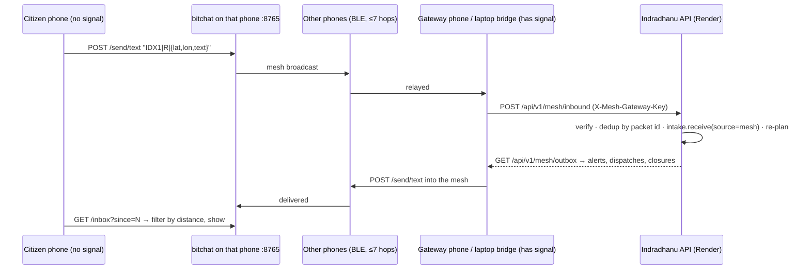

# Offline: online app first, bitchat mesh when there is no signal

## The design in one paragraph

With internet, nothing changes: the citizen app, the field app and the console
use the deployed API, with live routing, re-routing and maps. Without internet,
phones fall back to **bitchat**, which carries short text packets phone to phone
over Bluetooth. A packet reaches the deployed API as soon as **any** phone in
the chain (or a laptop beside one) has signal, and the control room's alerts,
dispatches and road closures travel back the same way. Every packet carries a
location, so each phone shows only what concerns where it is.

## Paths

## Packet: IDX1

`<human text> IDX1|<type>|<compact json>|<hmac16 or ->`. Human text first so a
person reading bitchat understands it; the rest for programs. Full spec in
`backend/app/mesh/envelope.py`.

| Type | Direction | Body keys |
|---|---|---|
| R report | in | id, n (device), k (category, optional), la, lo, x (text), t |
| S sensor | in | id, n (camera), k (fire/smoke/fall/…), c (confidence), f (frames), v (VLM agreed), la, lo, x (caption), t |
| F field status | in | id, u (unit), k (route_blocked/on_site/…), la, lo, x |
| H heartbeat, K ack | in | id, n / i (outbox id) |
| A alert | out | id, w (ward), la, lo, r (radius m), s (severity), x (instruction) |
| D dispatch / re-route | out | id, u, i, la, lo, m (ETA), x |
| C cancel | out | id, u, k (instead), x (reason) |
| B road closed | out | id, la, lo, r (150), x |

Signed with `MESH_HMAC_KEY` by the camera node and the bridge. Citizen packets
from the web app are unsigned (a key in a public web page is not a secret) and
are scored as `mesh_unsigned` (0.45 credibility), so they can open an incident
but never auto-dispatch on their own.

## How each existing feature behaves

| Feature | Online | Offline (mesh) |
|---|---|---|
| Citizen report | `/citizen/report`, photo, voice | text + GPS as IDX1 R; no photo, no voice |
| Where to go | live route from the guidance agent, re-routed round blocks | route saved while online, checked against closures heard on the mesh; else compass heading + distance to nearest cached shelter, labelled as a heading |
| Alerts | from the API, per ward | IDX1 A from the mesh, filtered by distance to this phone |
| Road closures | map layer | IDX1 B list |
| Crew dispatch | field app | IDX1 D / C in bitchat `#field` |
| Crew "road blocked" | field app button | IDX1 F (from the bridge; field-app mesh mode is a next step) |
| Map tiles | Mapbox | last cached state; tiles only if the browser cached them |
| Re-plan, CP-SAT, gate | cloud | still cloud: runs when packets arrive |
| Camera node | `/ingest/sensor` over HTTPS | IDX1 S via the bitchat phone on its Wi-Fi |

## Setting it up

1. **API** (Render): set `MESH_GATEWAY_KEY` and `MESH_HMAC_KEY` (long random
   strings). Migration 022 is already applied.
2. **bitchat fork** (`bitchat-android`): build in Android Studio, install, turn
   on Settings → VLM API. On phones that will have signal, enable gateway mode:
   `POST http://<phone>:8765/gateway {"enabled":true,"api_url":"https://…","gateway_key":"…"}`.
   See `docs/INDRADHANU_GATEWAY.md` in that repo.
3. **Or a laptop bridge** (no app rebuild, phone has no data but the laptop
   does): `python backend/scripts/mesh_bridge.py --api https://… --key … --phone <phone-ip>`.
4. **Stage demo without phones:**
   `python backend/scripts/mesh_bridge.py sim --api … --key … --hmac … --report flooded_road 18.52 73.85 "Water knee deep"`,
   or `POST /api/v1/demo/scenarios/mesh_blackout_sos/run`.
5. **Camera node** (`ai-surveillance/configs/pipeline.yaml`): set
   `indradhanu.enabled: true`, `api`, `gateway_key`, `hmac_key`, `node_id`,
   `lat`/`lon`; keep `disaster_mode: true`.
6. **Phone browser**: the first time mesh mode calls bitchat, Chrome asks to
   allow access to devices on the local network. Allow it.

## Limits

- Bluetooth mesh: tens of metres per hop, 7 hops (TTL), needs phones in range.
  A last-mile path, not a city network. LoRa (e.g. Meshtastic) is the answer for
  kilometres, and fits this packet format unchanged.
- Latency: seconds to minutes, depending on when a gateway gets signal.
- Text only. Images stay on the phone until it is online.
- iPhones: the fork is Android. Upstream bitchat on iOS relays the same mesh
  but has no local API, so an iPhone can relay packets but cannot run mesh mode.
- `/inbox` on the phone is open while the VLM API is on; it only returns what
  was already broadcast in the clear on the mesh.
